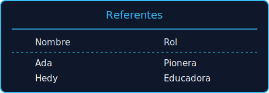

Ejemplos de Código
==================

A continuación se muestran pequeños programas escritos en Cobra que ilustran las principales características del lenguaje.

Hola Mundo
----------
.. code-block:: cobra

   imprimir("Hola, Cobra")

Manejo de holobits
------------------
.. code-block:: cobra

   var h = holobit([1.0, -0.5, 0.8])
   var proy = proyectar(h, '2D')
   graficar(proy)

Excepciones y hilos
-------------------
.. code-block:: cobra

   func tarea():
       throw "error"
   fin

   try:
       hilo tarea()
   catch e:
       imprimir(e)

Concurrencia asíncrona segura
-----------------------------

Las utilidades de ``standard_library.asincrono`` ayudan a mezclar corrutinas de
``asyncio`` con código bloqueante sin perder control sobre las cancelaciones.

.. code-block:: python

   import asyncio
   import standard_library as stlib

   async def main():
       trabajo = asyncio.create_task(asyncio.sleep(0.05, result="ok"))
       protegido = stlib.proteger_tarea(trabajo)
       protegido.cancel()  # la cancelación no afecta a la tarea original
       resultado = await trabajo
       print("terminó:", resultado)

       valor = await stlib.ejecutar_en_hilo(lambda: sum(range(10_000)))
       print("cálculo paralelo:", valor)

   asyncio.run(main())

Transpilación con Hololang
--------------------------
Los archivos disponibles en ``examples/hololang`` muestran cómo convertir
programas Cobra a Hololang y viceversa, además de generar salidas en Python o
ensamblador.  Ejecuta, por ejemplo:

.. code-block:: bash

   cobra compilar examples/hololang/saludo.co --backend hololang
   cobra transpilar-inverso examples/hololang/saludo.holo --origen hololang --destino python

El primer comando imprime la versión Hololang del programa ``saludo.co`` y el
segundo parte desde Hololang para reconstruir el código Python equivalente.

Interfaces de consola enriquecidas
----------------------------------

Las utilidades de ``standard_library.interfaz`` permiten componer tablas,
paneles y barras de progreso directamente desde Cobra o desde scripts Python.

.. code-block:: cobra

   usar standard_library.interfaz como ui

   var datos = [
       {"Nombre": "Ada", "Rol": "Pionera"},
       {"Nombre": "Grace", "Rol": "Arquitecta"},
   ]

   ui.mostrar_tabla(datos, titulo="Personas clave")
   ui.imprimir_aviso("Tabla generada", nivel="exito")

   Vista previa producida por ``mostrar_tabla`` en la consola.
